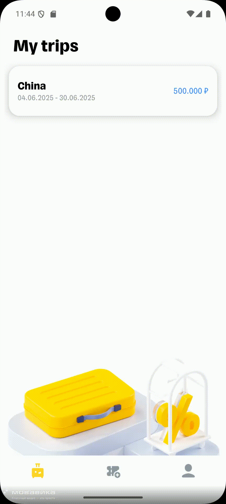

# T-TravelTogether

<div align="center">
  
</div>

## Overview

T-TravelTogether is an Android application that extends the T-Bank's travel service by enabling users to organize group trips, manage shared expenses, and coordinate with travel companions. The app helps users plan trips, track expenses, and automatically calculate shared costs among participants.

## Features

## Authentication Module
This module provides user authentication functionality, including both login and registration screens.
### Features
- **User Registration:**  
  Users can create new accounts via the registration screen, with input validation to ensure data integrity.
- **User Login:**  
  Existing users can log in securely using their credentials.
- **JWT Token Support:**  
  Upon successful authentication, a JWT (JSON Web Token) is issued. This token is used to authorize subsequent requests and manage user sessions securely.
- **Validation:**  
  All user input is validated both on the client side and before authentication, ensuring only valid data is processed.


### 🏷️ Trip Management
- Create and manage group trips with start and end dates
- Add participants via contacts or phone numbers
- Track trip status and participant confirmations
- View trip details and statistics


### 💰 Expense Management
- Set and track overall trip budget
- Categorize expenses (tickets, hotels, food, entertainment, insurance, etc.)
- Record individual and group expenses
- Automatic calculation of shared costs and debts
- View expense history and summaries


### 👤 User Profile & Settings
- Personalized user profiles
- Language switching (English/Russian)
- Dark/light theme toggle
- Secure logout
- Offline mode support with caching


### 🔔 Push Notifications
- New trip invitations
- Payment reminders
- Transaction updates


### 🔐 Security & Data Management
- Secure data storage using Room and EncryptedSharedPreferences
- Encrypted data transmission
- Privacy-first approach
- Secure authentication system

### 🎨 UI/UX Features
- Shimmer loading animations for better user experience
- Smooth transitions between screens
- Dark mode support
- Custom UI components
- Responsive layouts

## 🏗️ Architecture  
**Clean Architecture** with **MVVM** pattern:  

```
┌─────────────────────────────────────┐
│           Presentation              │
│  (Activitiy, Fragments, ViewModels)│
├─────────────────────────────────────┤
│              Domain                 │
│  (Use Cases, Models, Repositories)  │
├─────────────────────────────────────┤
│               Data                  │
│  (API, Database, Local Storage)     │
└─────────────────────────────────────┘
```

### Tech Stack  
- **Language:** Kotlin  
- **DI:** Hilt  
- **Networking:** Retrofit + OkHttp  
- **Local DB:** Room  
- **Async:** Coroutines + Flow  
- **UI Binding:** ViewBinding  
- **Push:** Firebase Cloud Messaging  
- **Security:** EncryptedSharedPreferences + JWT token

  ### Core Features
- ✅ Programmatic UI with XML
- ✅ Dark mode support
- ✅ Localization (Russian/English)
- ✅ Caching
- ✅ Push notifications
- ✅ Contact synchronization
- ✅ Room/EncryptedSharedPreferences integration
- ✅ Shimmer loading animations
- ✅ Coordinator-based navigation

### Code Quality
- ✅ Detekt integration
- ✅ Clean architecture
- ✅ Code reusability
- ✅ Dependency injection

## 🚀 Installation  
### Requirements  
- Android Studio Arctic Fox+  
- Android SDK 26+  
- JDK 11  

### Steps  
1. Clone repo:  
   ```bash
   git clone https://github.com/your-username/TTravelling.git
   ```
2. Add `google-services.json` to `app/`  
3. Configure API URL in `app/build.gradle.kts`:  
   ```kotlin
   buildConfigField("String", "API_URL", "\"http://141.105.71.181:8080\"")
   ```
